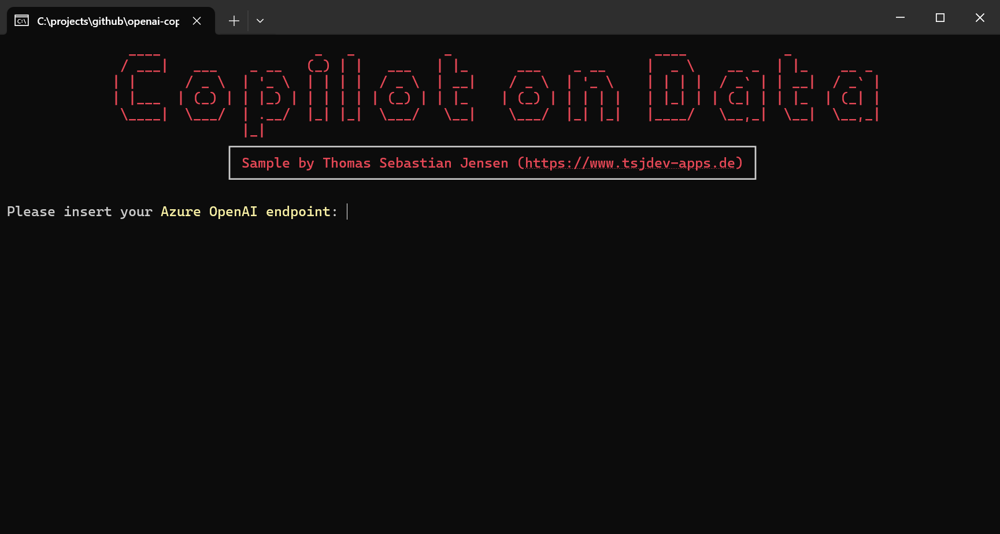
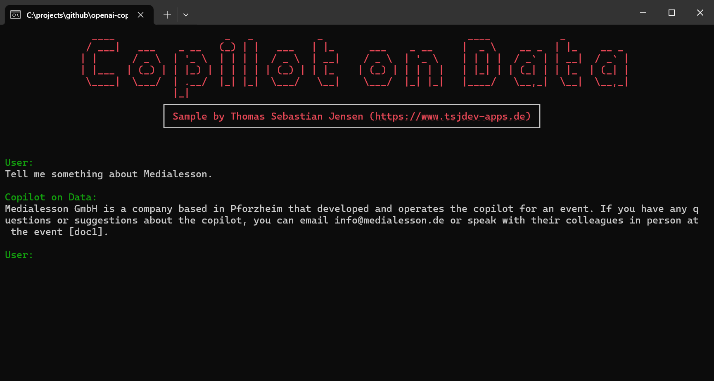

# Create a Copilot on your data using Azure.AI.OpenAI

This repository contains a simple .NET console application demonstrating the [Azure.AI.OpenAI NuGet package](https://www.nuget.org/packages/Azure.AI.OpenAI) to create a Copilot on your own data.

## Usage

You need to have your data prepared within an [Azure CosmosDB for MongoDB vCore](https://learn.microsoft.com/en-us/azure/cosmos-db/mongodb/vcore/) and you also need to ave access for the [Azure OpenAI](https://azure.microsoft.com/en-us/products/ai-services/openai-service) services within Azure. 

I assume that you already have your data stored with an `Azure Cosmos DB for MongoDB (vCore)` and your data is already embedded using an embedding model within `Azure OpenAI`.

Insert the needed values into the `Settings.cs` file or simply run the application, because in this case the console application is asking to enter all the needed values.

## Screenshots

Here you can se the console application in action.

If you don't provide the corresponding *settings* within the `Settings.cs` file, you have to insert the values on startup.

Then you are able to chat with your data. In the answer you will find the references to your data in your database.

